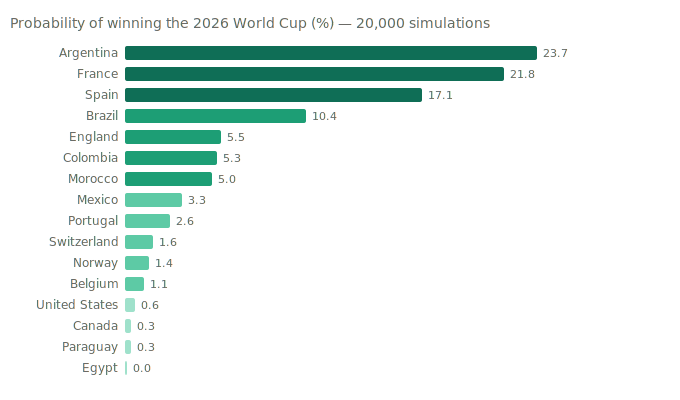
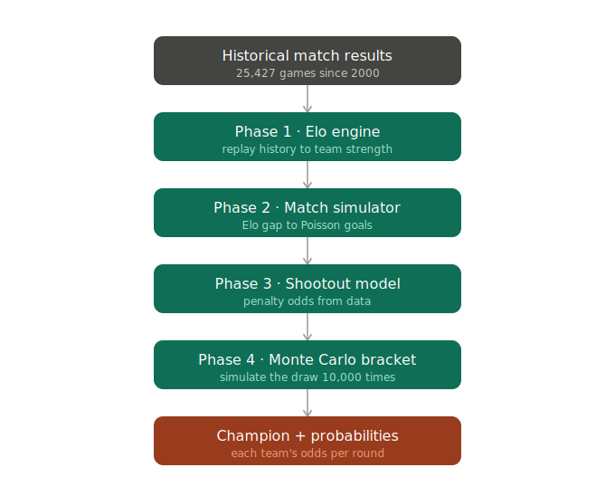
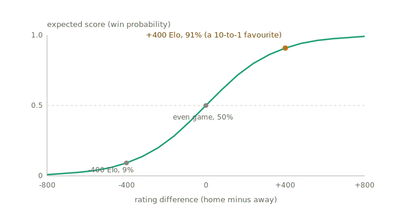

# World Cup 2026 Predictor

Predicts every 2026 FIFA World Cup knockout match — from-scratch and fully
explainable (**Elo → Poisson goals → Monte Carlo bracket**, no black-box
classifier). Backtested at **76.6%** on 12,000+ matches, and now graded **live**
against the tournament as it happens.

<!-- LIVE-ACCURACY:START -->
## Live scorecard · 10/14 correct (71%)

Every pick is committed to git **before kickoff**, then graded as results land — so this fills in round by round as WC2026 plays out.

| Round | Predicted | Result |
|---|---|---|
| Round of 16 | 8 picks | 5/8 correct |
| Quarter-finals | 4 picks | 4/4 correct |
| Semi-finals | 2 picks | 1/2 correct |
| Final | 1 picks | pending |

<details><summary>Round of 16 picks</summary>

| Match | Model pick | Confidence | Actual | Hit |
|---|---|---|---|---|
| Paraguay v France | France | 83% | France | ✅ |
| Canada v Morocco | Morocco | 69% | Morocco | ✅ |
| Portugal v Spain | Spain | 67% | Spain | ✅ |
| United States v Belgium | United States | 51% | Belgium | ❌ |
| Brazil v Norway | Brazil | 72% | Norway | ❌ |
| Mexico v England | England | 52% | England | ✅ |
| Argentina v Egypt | Argentina | 90% | Argentina | ✅ |
| Switzerland v Colombia | Colombia | 59% | Switzerland | ❌ |

</details>

<details><summary>Quarter-finals picks</summary>

| Match | Model pick | Confidence | Actual | Hit |
|---|---|---|---|---|
| France v Morocco | France | 72% | France | ✅ |
| Spain v Belgium | Spain | 84% | Spain | ✅ |
| Norway v England | England | 61% | England | ✅ |
| Argentina v Switzerland | Argentina | 80% | Argentina | ✅ |

</details>

<details><summary>Semi-finals picks</summary>

| Match | Model pick | Confidence | Actual | Hit |
|---|---|---|---|---|
| France v Spain | France | 53% | Spain | ❌ |
| Argentina v England | Argentina | 64% | Argentina | ✅ |

</details>

<details><summary>Final picks</summary>

| Match | Model pick | Confidence | Actual | Hit |
|---|---|---|---|---|
| Spain v Argentina | Spain | 66% | – | – |

</details>
<!-- LIVE-ACCURACY:END -->

## The call — who wins the 2026 World Cup?

**The final is set: Spain vs Argentina.** Spain's run through Portugal, Belgium
and France pushed their rating to a tournament-high **2245**, and the model
makes them clear favourites to lift the trophy.

<p align="center"></p>

| Team | **Win Cup** |
|---|---:|
| Spain | **66%** |
| Argentina | **34%** |

Predicted champion: **Spain** — the last pick on the scorecard, pending the
final.

Full numbers: [`data/processed/tournament_probabilities.csv`](data/processed/tournament_probabilities.csv).

### How the forecast has evolved

Like any live forecast (weather, elections, betting markets), the title odds
**update after every round** — new results are information, and ignoring them
would be wrong on purpose. Match picks, by contrast, are locked before kickoff
and never revised (see the scorecard above). Every snapshot below is preserved
in the git history:

| Title odds (%) | Before R16 | Before QF | Before SF | Final |
|---|---:|---:|---:|---:|
| Spain | 22 | **31** | 32 | **66** |
| France | **26** | 24 | **33** | *out (SF)* |
| Argentina | 21 | 23 | 24 | 34 |
| England | 5 | 11 | 11 | *out (SF)* |
| Brazil | 8 | *out (R16)* | – | – |

The same three teams topped every forecast, trading the lead as results landed:
Spain edged ahead by beating Portugal, France snatched it back with a clean 2-0
quarter-final, then Spain seized it for good by winning the France semi-final.
A champion call is one sample; the model's real track record is the match-level
scorecard at the top.

## How it works at a glance

Each stage's output feeds the next: decades of results become a strength number
per team, those numbers simulate any single match, and the whole knockout draw
is simulated thousands of times to see how often each team lifts the trophy.

<p align="center"></p>

Elo rates every team with a single number; before a match it turns the **gap**
between two ratings into a win probability via an S-shaped (logistic) curve — a
bigger lead means a higher, but never certain, chance of winning:

<p align="center"></p>

## Phase 1 — The Elo engine

`src/elo.py` replays every international match since 2000 (25,425 games) in
date order and maintains a running strength rating for all 321 national teams.

For each match:

1. **Predict** the home team's expected score from the rating gap, via the
   logistic formula

$$E_{\text{home}} = \frac{1}{1 + 10^{-(R_{\text{home}} - R_{\text{away}})/400}}$$

   A 400-point gap ≈ a 10-to-1 favorite. Home advantage (+65) is added to the
   expectation, but dropped on neutral ground (all World Cup knockouts).
2. **Observe** the actual result (win 1.0 / draw 0.5 / loss 0.0).
3. **Update** `R_new = R_old + K · G · (actual − expected)`.

`K` (learning rate) is weighted by match importance so a World Cup knockout
moves ratings more than a friendly:

| Tier | K |
|---|---|
| World Cup finals | 60 |
| Continental finals (Euro, Copa, AFCON, Asian Cup, Gold Cup, Confed) | 50 |
| Qualifiers / Nations League | 40 |
| Minor tournaments | 30 |
| Friendly | 20 |

`G` is a goal-difference multiplier: a 5-0 win is stronger evidence than a 1-0,
so bigger margins move ratings more (sub-linearly).

**Known model property:** penalty-shootout results are stored in `results.csv`
as draws (only the 120-minute score is recorded), so a knockout won on
penalties earns no "win" bump. `shootouts.csv` exists to correct for this and
is used in Phase 3.

## Phase 2 — The match simulator

`src/simulate.py` turns a rating gap into a scoreline. The goals-vs-Elo
relationship is **calibrated from history, not assumed**: binning 25k matches
shows ~1 goal of expected margin per 174 Elo points, and total goals rise
slightly with the mismatch. Each team's expected goals (λ) feed a **Poisson
distribution**; crossing the two teams' distributions gives the probability of
every scoreline, and hence win / draw / loss.

Validated on pre-match ratings only: predicted draw rate 21% vs 23% actual,
average goals 2.76 vs 2.76, and the Elo favourite wins **76.6%** of decided
matches across 12,000+ games since 2010 (13/13 on the 2026 R32 knockouts).

## Phase 3 — Shootout calibration

`shootouts.csv` says the favourite wins a shootout only **~54%** of the time, so
penalties are close to a coin flip. `shootout_prob` reuses the logistic curve
with a far wider scale (1250 vs 400) — a level tie is 50/50, a big favourite
gets only a mild edge — replacing the earlier flat assumption for knockout ties.

## Phase 4 & 5 — Monte Carlo bracket and output

`src/bracket.py` plays the R16 → final **20,000 times**. Every tie is drawn from
the Phase 2 goal model, level games go to extra time then the Phase 3 shootout,
and winners advance up the tree. Counting the outcomes yields each team's
probability of reaching every round and winning the cup (the results above),
saved to `data/processed/tournament_probabilities.csv`.

## Run it

```bash
pip install -r requirements.txt
python src/elo.py        # Phase 1 — ratings -> data/processed/elo_ratings.csv
python src/simulate.py   # Phase 2/3 — calibration, backtest, R16 predictions
python src/bracket.py    # Phase 4/5 — full tournament odds + predicted bracket
python src/track.py      # Phase 5 — log predictions, score rolling accuracy
```

## Live tracking (predicted vs actual)

`src/track.py` locks in the model's pre-match call for every knockout tie and,
as real results land, scores **rolling accuracy** and a **Brier score** (a
calibration measure — 0.25 is a coin flip, lower is better). Predictions are
written once and never recomputed, so [`knockout_tracking.csv`](data/processed/knockout_tracking.csv)
is an honest, timestamped record of how the model does as the 2026 knockouts
actually play out — the headline accuracy number grows with every round.

## Data

Kaggle: *International football results from 1872 to 2026* (martj42).
`data/raw/results.csv` (match results) and `data/raw/shootouts.csv`
(penalty-shootout winners).
